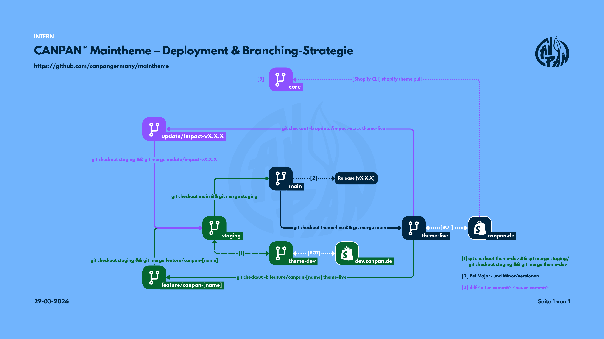

# CANPAN™ Maintheme – Repository

> [!IMPORTANT]
> **Sprache:** Commits, Code-Kommentare und sonstige Dokumentation im 
> Repository sind grundsätzlich auf **Deutsch** zu verfassen.

Dieses Repository enthält die Code-Basis für das **CANPAN™ Maintheme**, 
basierend auf dem **Impact Theme** von Maestrooo 
([offizielle Dokumentation](https://support.maestrooo.com/category/741-impact)).

Der Fokus dieses Projekts liegt auf maximaler Performance, der Einhaltung 
aktueller Core Web Vitals und schnellen Ladezeiten. Bei allen Code-Beiträgen 
ist sicherzustellen, dass kritische Metriken wie der LCP (Largest Contentful 
Paint) nicht beeinträchtigt werden.

> Für das lokale Setup und die Einrichtung der Entwicklungsumgebung 
> siehe [Getting Started im CANPAN Notion-Space](notion-link).

## Branching-Strategie & Deployments

Der Entwicklungsprozess folgt einem strikten Workflow. Direkte Commits 
in den `main`-Branch sind untersagt.



* **core**: **Absolutes Sperrgebiet.** Enthält das unveränderte 
  Original-Theme als Basis für manuelle Updates. Keine 
  projektspezifischen Anpassungen.
* **pre-launch**: Die **aktive Entwicklungsumgebung bis zum Launch.** 
  Alle Anpassungen und Features fließen hier zusammen, bis der Shop 
  live geht. Wird beim Launch in `main` gemergt und entspricht dann 
  `v1.0.0`.
* **main**: Die **Live-Umgebung** – wird ab Launch aktiv. Hier landet 
  ausschließlich Code, der erfolgreich auf Performance und Stabilität 
  getestet wurde.
* **staging**: Die **Testumgebung** – wird ab Launch aktiv. Dient der 
  Integration und den finalen QA- sowie Lighthouse-Tests.
* **theme-dev**: Der **Shopify-Branch für den Dev-Store** – Automatische 
  Commits des Shopify Online-Editors auf dem Dev-Store (dev.canpan.de) 
  landen hier. Hält `staging` sauber und frei von unkontrollierten 
  Auto-Commits.
* **theme-live**: Der **Shopify-Branch für den Live-Store** – wird ab 
  Launch aktiv. Automatische Commits des Shopify Online-Editors landen 
  hier. Hält `main` sauber und frei von unkontrollierten Auto-Commits.
* **Feature-Branches**: Für jedes Feature ist ein eigener Branch nach 
  dem Muster `feature/canpan-[name]` zu erstellen. Ein PR erfolgt 
  immer zuerst in den `pre-launch`-Branch (vor Launch) bzw. 
  `staging`-Branch (ab Launch).

### Theme-Updates manuell nachziehen

1. Neue Version des Impact Themes herunterladen (`shopify theme pull`)
2. Die aktualisierten Theme-Dateien in `core` einspielen und committen
3. Core-Tag setzen (`core-vX.X.X`)
4. Mit `git diff core-vX.X.X (alt) core-vX.X.X (neu)` prüfen, welche 
   Dateien sich zwischen dem alten und neuen Original unterscheiden
5. Konflikte identifizieren – also Stellen, an denen `canpan-`-Anpassungen 
   mit den neuen Theme-Dateien kollidieren
6. `update/impact-vX.X.X`-Branch aus `theme-live` erstellen und 
   relevante Änderungen gezielt übernehmen
7. Per PR in `staging` mergen

> [!TIP]
> **Changelog-Source:** Für den `core`-Branch wird kein lokales Changelog 
> gepflegt. Offizielle Änderungen sind den 
> [Impact Release Notes](https://themes.shopify.com/themes/impact/presets/impact#ReleaseNotes) 
> zu entnehmen.

## Konventionen

### 1. Commit-Konventionen

Commits folgen dem [Conventional Commits](https://www.conventionalcommits.org/)-Standard. 
Das Format ist:
```
<type>(<scope>): <beschreibung>
```

**Typen:**
* `feat` – Neues Feature
* `fix` – Bugfix
* `chore` – Wartung, Abhängigkeiten, Konfiguration
* `perf` – Performance-Optimierung
* `refactor` – Code-Umstrukturierung ohne funktionale Änderung
* `docs` – Dokumentation

**Scope** ist optional und bezeichnet den betroffenen Bereich 
(z. B. `canpan-hero`, `canpan-nav`).

**Beispiele:**
```
feat(canpan-hero): lazy loading für Banner-Bild hinzugefügt
fix(canpan-nav): mobilen Breakpoint korrigiert
perf: Drittanbieter-Skripte mit defer geladen
chore: .gitignore aktualisiert
```

### 2. Code-Kommentar-Konvention

Jede neu hinzugefügte Codezeile oder Anpassung wird mit einem Kommentar 
im folgenden Format versehen:

* **Vor Launch (CSS/JS):** `/* CANPAN QoL PRE-LAUNCH – Kurze Beschreibung der Änderung */`
* **Vor Launch (Liquid):** ` CANPAN QoL PRE-LAUNCH – Kurze Beschreibung der Änderung `
* **Ab Launch (CSS/JS):** `/* CANPAN QoL X.X.X – Kurze Beschreibung der Änderung */`
* **Ab Launch (Liquid):** ` CANPAN QoL X.X.X – Kurze Beschreibung der Änderung `

**Formatierungsregeln:**
* Ein Leerzeichen vor und nach dem Kommentarinhalt (innerhalb der Kommentar-Delimiter)
* Kein Punkt am Ende der Beschreibung

Die Versionsnummer folgt [Semantic Versioning](https://semver.org/) 
(`MAJOR.MINOR.PATCH`): `MAJOR` für Breaking Changes, `MINOR` für neue 
Features, `PATCH` für Bugfixes. Die jeweils aktuelle Version ist der 
`VERSION.md`-Datei zu entnehmen (Source of Truth).

### 3. Namenskonventionen (canpan- Präfix)

Um Konflikte mit zukünftigen Theme-Updates zu vermeiden, muss jedes neu 
erstellte Element das Präfix `canpan-` tragen. Dies gilt ausnahmslos für:

* **CSS-Klassen & IDs** (z. B. `.canpan-hero-banner`)
* **JavaScript-Dateien** (z. B. `canpan-custom-script.js`)
* **Liquid-Sektionen & Snippets** (z. B. `canpan-section-header.liquid`)
* **CSS-Variablen**

> [!IMPORTANT]
> Originale Klassen des Impact Themes dürfen **nicht direkt überschrieben** 
> werden. Stattdessen sind diese sauber über eigene `canpan-`-Klassen 
> zu erweitern.

### 4. Erhalt von Kommentaren

Die Dokumentation und Historie des Theme-Cores ist essenziell.

* Vorhandene Code-Kommentare aus dem originalen Impact-Theme dürfen 
  nicht entfernt werden.
* Bei der Optimierung von bestehendem Code sind die zugehörigen 
  Originalkommentare exakt in die neue Code-Struktur zu übernehmen.

## Changelog

Änderungen und Releases werden in der `CHANGELOG.md` dokumentiert. 
Einträge werden stets am Anfang der Datei eingefügt, sodass der 
aktuellste Stand unmittelbar sichtbar ist.

Die aktuelle Versionsnummer ist der `VERSION.md`-Datei zu entnehmen 
(Source of Truth). Sie wird manuell vor jedem Release-Commit 
aktualisiert.

### Workflow

KI-Tools dokumentieren alle vorgenommenen Änderungen ausschließlich 
in der `TEMP-CHANGELOG.md`. Die `CHANGELOG.md` wird manuell gepflegt.

Vor jedem Merge in `main` ist folgender Ablauf einzuhalten:

1. Inhalte aus `TEMP-CHANGELOG.md` prüfen und in `CHANGELOG.md` übernehmen
2. Commit durchführen

> [!IMPORTANT]
> Die `TEMP-CHANGELOG.md` wird nicht committed – sie ist in `.gitignore` 
> eingetragen und dient ausschließlich als temporäre Ablage für 
> KI-generierte Änderungsnotizen.

## Versionierung & Releases

Tags und Releases werden automatisch per GitHub Action erstellt – ausschließlich bei einem Merge in `main`.

* **Tag**: wird bei jedem Merge gesetzt (`qol-vX.X.X`)
* **GitHub Release**: wird nur bei Major- und Minor-Versionen erstellt (Patch = 0), mit dem Inhalt der `VERSION.md` als Release-Body
* **`VERSION.md`** enthält in Zeile 1 die aktuelle Entwicklungsversion sowie ab Zeile 2 die Release-Beschreibung

> [!IMPORTANT]
> `VERSION.md` muss vor jedem Merge in `main` manuell auf die nächste Version aktualisiert werden. Stimmt die Version in `VERSION.md` mit dem letzten Eintrag in `CHANGELOG.md` überein, schlägt die Action fehl.

## KI-Nutzung

Der Einsatz von KI-Tools in der Entwicklung ist ausdrücklich erlaubt 
und erwünscht. Aktuell erprobt und empfohlen: **Claude** von Anthropic.

Für folgende Tools existieren Anweisungsdateien im Root-Verzeichnis, 
die automatisch eingelesen werden:

| Datei | Tool |
|---|---|
| `CLAUDE.md` | Anthropic Claude |
| `GEMINI.md` | Google Gemini |
| `AGENTS.md` | OpenAI ChatGPT / Codex |

## Dokumentation

Der `.github/`-Ordner enthält neben GitHub-Konfigurationsdateien auch interne Referenzdokumente.

| Datei | Beschreibung |
|---|---|
| `29-03-2026_CANPAN_Maintheme_Deployment_und_Branching_Strategie.png` | Visuelles Diagramm der Branching-Strategie und Deployment-Flows |